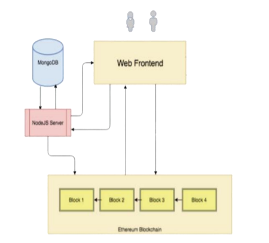
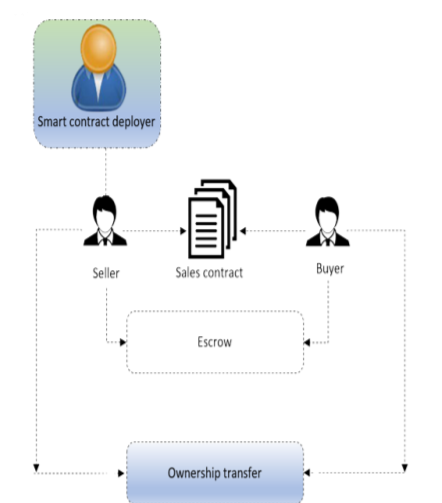
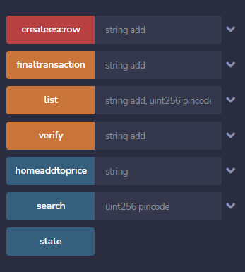

# Real-estate-project

In this project we have tried to move the offline real estate transactions onto an Ethereum blockchain so as to make those transactions fast and hassle-free. Also executing the transactions on a blockchain resolves the most important aspect in the  real estate i.e. the lack of trust between the participating parties. The diagrams present in the ARCHITECTURE folder gives us an idea of how we intent on implementing the same.

The paper regarding this project can be read at this link
```
https://drive.google.com/file/d/1Nqhd5b6jHYBlAHjHkXlgCvsCAJGUf98R/view?usp=sharing`
```
## Architecture




## Deployed Contract


